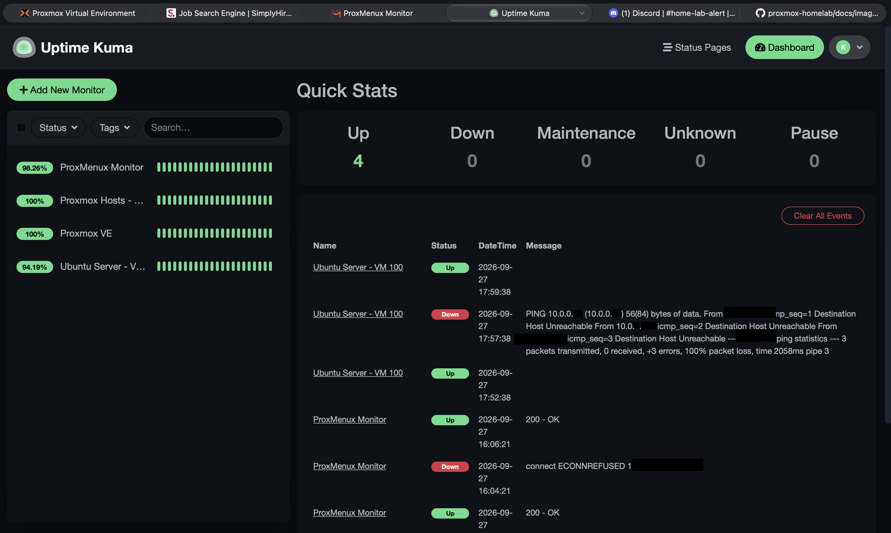
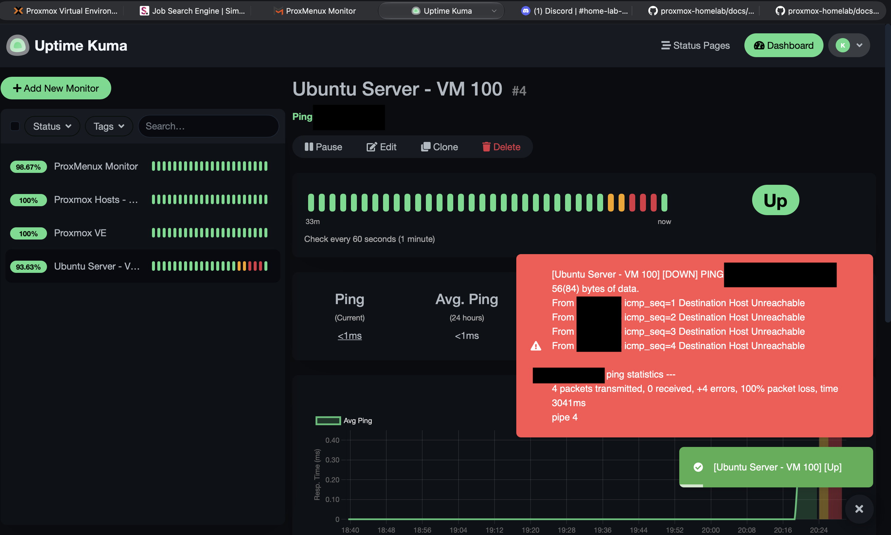
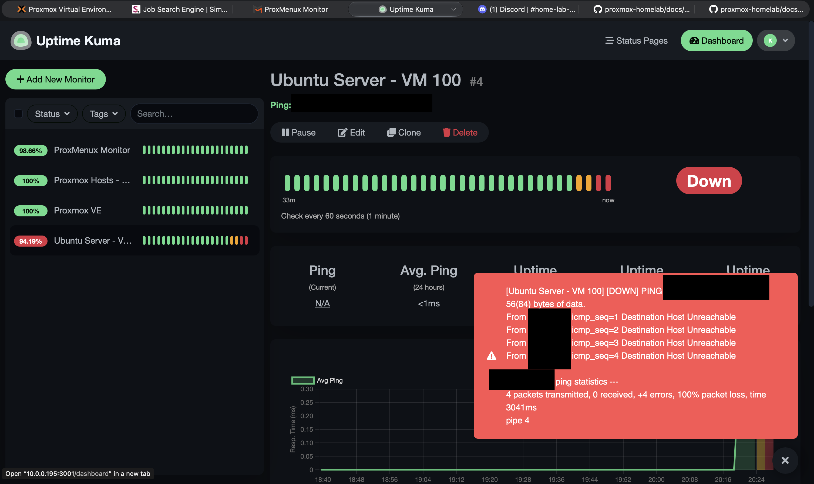
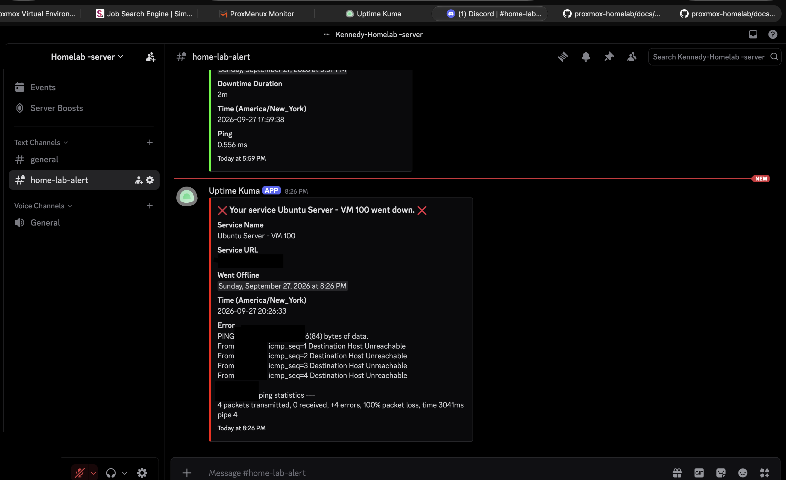
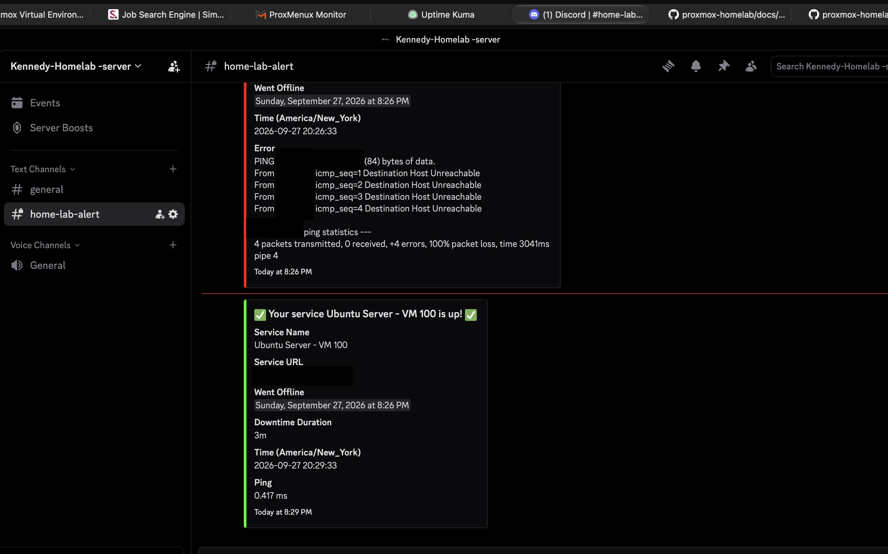

# Project 01 — Infrastructure Monitoring & Automated Recovery

## Objective

The objective of this project was to build a monitoring system for my
Proxmox homelab that can detect service outages, send notifications,
and automatically resume monitoring after the Proxmox host reboots.

## Environment

- Proxmox VE 9
- Ubuntu Server 24.04 LTS
- Uptime Kuma running in an LXC container
- ProxMenux Monitor
- QEMU Guest Agent
- Discord notifications

## Monitoring Architecture

Uptime Kuma is used as the central monitoring service.

The following systems are currently monitored:

- Proxmox Host
- Proxmox VE web interface
- Ubuntu Server VM
- ProxMenux Monitor

Uptime Kuma performs periodic health checks and records availability,
response time, and downtime events.

## Discord Alerting

I configured Uptime Kuma to send notifications to a dedicated Discord
channel.

The system sends notifications when:

- A monitored service becomes unavailable
- A service recovers
- Connectivity is restored after an outage

This allows infrastructure problems to be detected without constantly
watching the monitoring dashboard.

## QEMU Guest Agent

I installed and configured QEMU Guest Agent on the Ubuntu Server VM.

This allows Proxmox to communicate more effectively with the guest
operating system and retrieve information such as the VM's IP address.

During configuration, the guest agent initially failed to start because
the Proxmox VM-side QEMU Guest Agent option had not yet been enabled.

After enabling QEMU Guest Agent in the VM options and restarting the VM,
the agent started successfully and Proxmox was able to display the
Ubuntu Server IP address.

## Automatic Startup

To make the environment recover automatically after a host restart, I
configured startup ordering in Proxmox.

### Ubuntu Server

- Start at boot: Enabled
- Startup order: 1
- Startup delay: 30 seconds

### Uptime Kuma

- Start at boot: Enabled
- Startup order: 2
- Startup delay: 10 seconds

The Ubuntu Server starts before the monitoring container so that the
infrastructure being monitored has time to initialize before monitoring
fully resumes.

## Recovery Test

I performed a full reboot of the Proxmox host to test the configuration.

After the reboot:

1. Proxmox returned online.
2. Ubuntu Server started automatically.
3. Uptime Kuma started automatically.
4. Monitoring resumed.
5. The Ubuntu Server responded successfully to health checks.
6. Windows 11 remained powered off because automatic startup was not
   configured for that VM.

The test confirmed that the monitoring infrastructure can recover from
a Proxmox host restart without manually starting each service.

## Troubleshooting

During this project I encountered several issues:

- QEMU Guest Agent package availability
- QEMU Guest Agent service startup failure
- VM IP address not appearing in Proxmox
- Testing outage detection
- Configuring Discord recovery notifications
- Configuring VM/container startup order

Each issue was investigated and resolved through configuration checks,
service verification, and controlled testing.

## Skills Practiced

- Proxmox VE administration
- Linux server administration
- Virtual machines and LXC containers
- QEMU Guest Agent
- Infrastructure monitoring
- Service availability testing
- Discord webhook notifications
- Troubleshooting
- Startup automation
- Disaster/recovery testing

## Evidence

### Proxmox Node Overview

The Proxmox VE dashboard shows the physical homelab node, running virtual machines and containers, and current host resource utilization.

### Uptime Kuma Monitoring

Uptime Kuma monitors the availability of the homelab infrastructure. The dashboard demonstrates successful monitoring as well as recorded downtime and recovery events.

### Controlled VM Outage Test

A controlled outage test was performed on Ubuntu Server VM 100 to validate the monitoring and alerting workflow. Before the test, the VM was online and responding normally.

The Ubuntu VM was then manually shut down to simulate a service outage. Uptime Kuma detected that the VM was no longer reachable.

### Discord Outage Alert

After the outage was detected, Uptime Kuma automatically sent a notification to the homelab Discord alert channel, confirming that Ubuntu Server VM 100 was down.

### Recovery Verification

The VM was manually started again. Uptime Kuma detected that the service had recovered and automatically sent a recovery notification to Discord.

